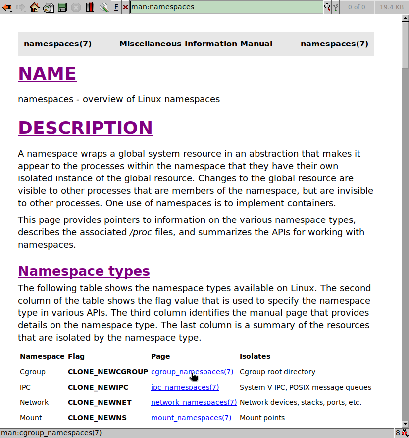
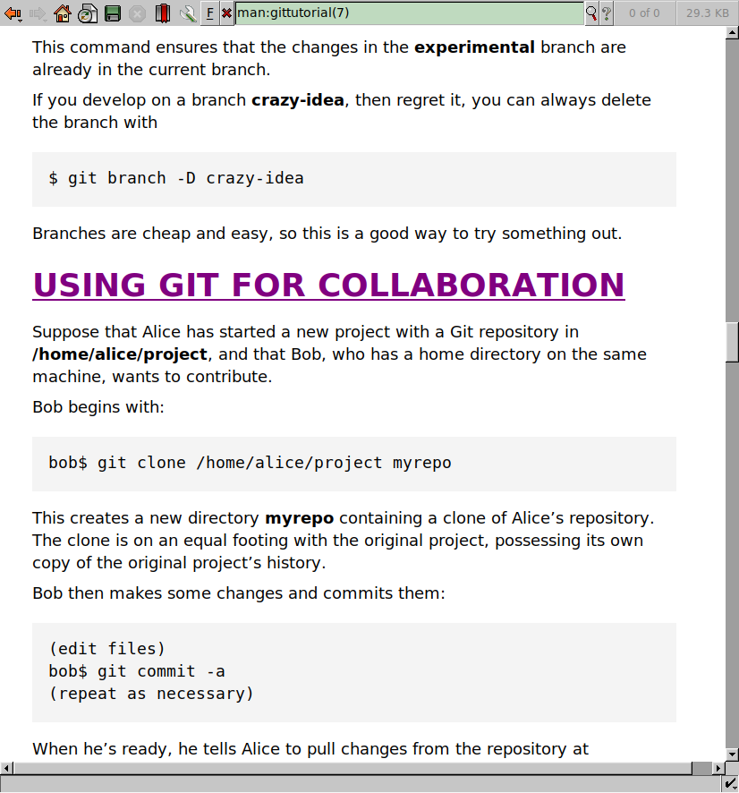

# Man plugin for Dillo

Shows local manual pages as HTML in Dillo with clickable links to other
manual pages. It uses the [man(1)](man:man) program to generate the HTML
from the manual pages (with the -T html extension) and [sed(1)](man:sed)
to manipulate the HTML.

It comes with a CSS style file that improves the display of manual
pages and can be modified to change the appearance.

<p align="center">
</p>

## Installation

To install the plugin use:

```
$ make install
```

The two files `man.filter.dpi` and `style.css` will be copied into 
`~/.dillo/dpi/man/`. Edit `style.css` as needed.

## Usage

The manual pages are accessed by the name of the manual page alone, 
`man:bash`, or with the section number in parenthesis to specify the
manual section, `man:read(3)`.

Here are some examples to test it from the command line:

```
$ dillo man:git
$ dillo man:namespaces
$ dillo "man:groff(7)"
```
